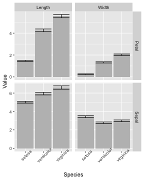

<style>
.reveal section code {
  font-size: 1em;
}
</style>


tidyr (and broom)
========================================================
author: Etienne Low-Décarie
transition: zoom

Long vs wide data
===

Wide


Long


Tidy vs untidy data
===

Tidy data

1. Each variable forms a column.
2. Each observation forms a row.
3. Each type of observational unit forms a table.

Messy data
- Anything else

[Wickham, H. (2014). Tidy Data. J. Stat. Softw., 59, 1–2.](http://www.jstatsoft.org/article/view/v059i10/v59i10.pdf)


History
===

- `reshape` and `reshape2` 
  - melt and cast
  - aggregate: summary calculations
- `tidyr`
  - only data frames
  - simple unique use verbs
  - no summarising/aggregation


Going from wide to long
===
class: small-code

`gather`


```r
long_data<-gather(wide_data,
                  key,
                  value,
                  selected_columns)
```

`melt` in `reshape`(`2`)

Ways to select columns
===

- Use bare variable names.

```r
long_iris<-gather(iris,"Measurement",
                  "Value",
                  Sepal.Length,
                  Sepal.Width,
                  Petal.Length,
                  Petal.Width)

grid.table(head(long_iris))
```


Ways to select columns
===

- Select all variables between `x` and `z` with `x:z`

```r
long_iris<-gather(iris,"Measurement",
                  "Value",
                  Sepal.Length:Petal.Width)
```


Ways to select columns
===

- Exclude y with `-y`.

```r
long_iris<-gather(iris,"Measurement",
                  "Value",
                  -Species)
```


Exercise 1
===

- basic challenge
  - make a histogram for each species in `data(BCI)` (`require(vegan)`)
  -hint : save to a big pdf!
  
<div class="centered">

<script src="countdown.js" type="text/javascript"></script>
<script type="application/javascript">
var myCountdown2 = new Countdown({
    							time: 300, 
									width:150, 
									height:80, 
									rangeHi:"minute"	// <- no comma on last item!
									});

</script>

</div>

- extra challenge:  
use `gather` to produce a data.frame from an image file
that can be plotted using ggplot
  - use the `.nc` of world sea temperature file in the `Data` folder

Going from long to wide
===

`spread`


```r
wide_data <- spread(long_data,
                    key,
                    value)
```

(`d`/`a`)cast in `reshape`(`2`)

Going from long to wide
===


```r
wide_iris <- spread(long_iris,
                    Species,
                    Value)
```

Going from long to wide
===
Each case must have a label!


```r
iris$Specimen <- rep(1:50,3) #Assumes specimen 1 of setosa
                            #matches specimen 1 of versicolor

long_iris<-gather(iris,"Measurement",
                  "Value",
                  Sepal.Length:Petal.Width)

wide_iris <- spread(long_iris,
                    Species,
                    Value)

wide_iris
```

```
    Specimen  Measurement setosa versicolor virginica
1          1 Petal.Length    1.4        4.7       6.0
2          1  Petal.Width    0.2        1.4       2.5
3          1 Sepal.Length    5.1        7.0       6.3
4          1  Sepal.Width    3.5        3.2       3.3
5          2 Petal.Length    1.4        4.5       5.1
6          2  Petal.Width    0.2        1.5       1.9
7          2 Sepal.Length    4.9        6.4       5.8
8          2  Sepal.Width    3.0        3.2       2.7
9          3 Petal.Length    1.3        4.9       5.9
10         3  Petal.Width    0.2        1.5       2.1
11         3 Sepal.Length    4.7        6.9       7.1
12         3  Sepal.Width    3.2        3.1       3.0
13         4 Petal.Length    1.5        4.0       5.6
14         4  Petal.Width    0.2        1.3       1.8
15         4 Sepal.Length    4.6        5.5       6.3
16         4  Sepal.Width    3.1        2.3       2.9
17         5 Petal.Length    1.4        4.6       5.8
18         5  Petal.Width    0.2        1.5       2.2
19         5 Sepal.Length    5.0        6.5       6.5
20         5  Sepal.Width    3.6        2.8       3.0
21         6 Petal.Length    1.7        4.5       6.6
22         6  Petal.Width    0.4        1.3       2.1
23         6 Sepal.Length    5.4        5.7       7.6
24         6  Sepal.Width    3.9        2.8       3.0
25         7 Petal.Length    1.4        4.7       4.5
26         7  Petal.Width    0.3        1.6       1.7
27         7 Sepal.Length    4.6        6.3       4.9
28         7  Sepal.Width    3.4        3.3       2.5
29         8 Petal.Length    1.5        3.3       6.3
30         8  Petal.Width    0.2        1.0       1.8
31         8 Sepal.Length    5.0        4.9       7.3
32         8  Sepal.Width    3.4        2.4       2.9
33         9 Petal.Length    1.4        4.6       5.8
34         9  Petal.Width    0.2        1.3       1.8
35         9 Sepal.Length    4.4        6.6       6.7
36         9  Sepal.Width    2.9        2.9       2.5
37        10 Petal.Length    1.5        3.9       6.1
38        10  Petal.Width    0.1        1.4       2.5
39        10 Sepal.Length    4.9        5.2       7.2
40        10  Sepal.Width    3.1        2.7       3.6
41        11 Petal.Length    1.5        3.5       5.1
42        11  Petal.Width    0.2        1.0       2.0
43        11 Sepal.Length    5.4        5.0       6.5
44        11  Sepal.Width    3.7        2.0       3.2
45        12 Petal.Length    1.6        4.2       5.3
46        12  Petal.Width    0.2        1.5       1.9
47        12 Sepal.Length    4.8        5.9       6.4
48        12  Sepal.Width    3.4        3.0       2.7
49        13 Petal.Length    1.4        4.0       5.5
50        13  Petal.Width    0.1        1.0       2.1
51        13 Sepal.Length    4.8        6.0       6.8
52        13  Sepal.Width    3.0        2.2       3.0
53        14 Petal.Length    1.1        4.7       5.0
54        14  Petal.Width    0.1        1.4       2.0
55        14 Sepal.Length    4.3        6.1       5.7
56        14  Sepal.Width    3.0        2.9       2.5
57        15 Petal.Length    1.2        3.6       5.1
58        15  Petal.Width    0.2        1.3       2.4
59        15 Sepal.Length    5.8        5.6       5.8
60        15  Sepal.Width    4.0        2.9       2.8
61        16 Petal.Length    1.5        4.4       5.3
62        16  Petal.Width    0.4        1.4       2.3
63        16 Sepal.Length    5.7        6.7       6.4
64        16  Sepal.Width    4.4        3.1       3.2
65        17 Petal.Length    1.3        4.5       5.5
66        17  Petal.Width    0.4        1.5       1.8
67        17 Sepal.Length    5.4        5.6       6.5
68        17  Sepal.Width    3.9        3.0       3.0
69        18 Petal.Length    1.4        4.1       6.7
70        18  Petal.Width    0.3        1.0       2.2
71        18 Sepal.Length    5.1        5.8       7.7
72        18  Sepal.Width    3.5        2.7       3.8
73        19 Petal.Length    1.7        4.5       6.9
74        19  Petal.Width    0.3        1.5       2.3
75        19 Sepal.Length    5.7        6.2       7.7
76        19  Sepal.Width    3.8        2.2       2.6
77        20 Petal.Length    1.5        3.9       5.0
78        20  Petal.Width    0.3        1.1       1.5
79        20 Sepal.Length    5.1        5.6       6.0
80        20  Sepal.Width    3.8        2.5       2.2
81        21 Petal.Length    1.7        4.8       5.7
82        21  Petal.Width    0.2        1.8       2.3
83        21 Sepal.Length    5.4        5.9       6.9
84        21  Sepal.Width    3.4        3.2       3.2
85        22 Petal.Length    1.5        4.0       4.9
86        22  Petal.Width    0.4        1.3       2.0
87        22 Sepal.Length    5.1        6.1       5.6
88        22  Sepal.Width    3.7        2.8       2.8
89        23 Petal.Length    1.0        4.9       6.7
90        23  Petal.Width    0.2        1.5       2.0
91        23 Sepal.Length    4.6        6.3       7.7
92        23  Sepal.Width    3.6        2.5       2.8
93        24 Petal.Length    1.7        4.7       4.9
94        24  Petal.Width    0.5        1.2       1.8
95        24 Sepal.Length    5.1        6.1       6.3
96        24  Sepal.Width    3.3        2.8       2.7
97        25 Petal.Length    1.9        4.3       5.7
98        25  Petal.Width    0.2        1.3       2.1
99        25 Sepal.Length    4.8        6.4       6.7
100       25  Sepal.Width    3.4        2.9       3.3
101       26 Petal.Length    1.6        4.4       6.0
102       26  Petal.Width    0.2        1.4       1.8
103       26 Sepal.Length    5.0        6.6       7.2
104       26  Sepal.Width    3.0        3.0       3.2
105       27 Petal.Length    1.6        4.8       4.8
106       27  Petal.Width    0.4        1.4       1.8
107       27 Sepal.Length    5.0        6.8       6.2
108       27  Sepal.Width    3.4        2.8       2.8
109       28 Petal.Length    1.5        5.0       4.9
110       28  Petal.Width    0.2        1.7       1.8
111       28 Sepal.Length    5.2        6.7       6.1
112       28  Sepal.Width    3.5        3.0       3.0
113       29 Petal.Length    1.4        4.5       5.6
114       29  Petal.Width    0.2        1.5       2.1
115       29 Sepal.Length    5.2        6.0       6.4
116       29  Sepal.Width    3.4        2.9       2.8
117       30 Petal.Length    1.6        3.5       5.8
118       30  Petal.Width    0.2        1.0       1.6
119       30 Sepal.Length    4.7        5.7       7.2
120       30  Sepal.Width    3.2        2.6       3.0
121       31 Petal.Length    1.6        3.8       6.1
122       31  Petal.Width    0.2        1.1       1.9
123       31 Sepal.Length    4.8        5.5       7.4
124       31  Sepal.Width    3.1        2.4       2.8
125       32 Petal.Length    1.5        3.7       6.4
126       32  Petal.Width    0.4        1.0       2.0
127       32 Sepal.Length    5.4        5.5       7.9
128       32  Sepal.Width    3.4        2.4       3.8
129       33 Petal.Length    1.5        3.9       5.6
130       33  Petal.Width    0.1        1.2       2.2
131       33 Sepal.Length    5.2        5.8       6.4
132       33  Sepal.Width    4.1        2.7       2.8
133       34 Petal.Length    1.4        5.1       5.1
134       34  Petal.Width    0.2        1.6       1.5
135       34 Sepal.Length    5.5        6.0       6.3
136       34  Sepal.Width    4.2        2.7       2.8
137       35 Petal.Length    1.5        4.5       5.6
138       35  Petal.Width    0.2        1.5       1.4
139       35 Sepal.Length    4.9        5.4       6.1
140       35  Sepal.Width    3.1        3.0       2.6
141       36 Petal.Length    1.2        4.5       6.1
142       36  Petal.Width    0.2        1.6       2.3
143       36 Sepal.Length    5.0        6.0       7.7
144       36  Sepal.Width    3.2        3.4       3.0
145       37 Petal.Length    1.3        4.7       5.6
146       37  Petal.Width    0.2        1.5       2.4
147       37 Sepal.Length    5.5        6.7       6.3
148       37  Sepal.Width    3.5        3.1       3.4
149       38 Petal.Length    1.4        4.4       5.5
150       38  Petal.Width    0.1        1.3       1.8
151       38 Sepal.Length    4.9        6.3       6.4
152       38  Sepal.Width    3.6        2.3       3.1
153       39 Petal.Length    1.3        4.1       4.8
154       39  Petal.Width    0.2        1.3       1.8
155       39 Sepal.Length    4.4        5.6       6.0
156       39  Sepal.Width    3.0        3.0       3.0
157       40 Petal.Length    1.5        4.0       5.4
158       40  Petal.Width    0.2        1.3       2.1
159       40 Sepal.Length    5.1        5.5       6.9
160       40  Sepal.Width    3.4        2.5       3.1
161       41 Petal.Length    1.3        4.4       5.6
162       41  Petal.Width    0.3        1.2       2.4
163       41 Sepal.Length    5.0        5.5       6.7
164       41  Sepal.Width    3.5        2.6       3.1
165       42 Petal.Length    1.3        4.6       5.1
166       42  Petal.Width    0.3        1.4       2.3
167       42 Sepal.Length    4.5        6.1       6.9
168       42  Sepal.Width    2.3        3.0       3.1
169       43 Petal.Length    1.3        4.0       5.1
170       43  Petal.Width    0.2        1.2       1.9
171       43 Sepal.Length    4.4        5.8       5.8
172       43  Sepal.Width    3.2        2.6       2.7
173       44 Petal.Length    1.6        3.3       5.9
174       44  Petal.Width    0.6        1.0       2.3
175       44 Sepal.Length    5.0        5.0       6.8
176       44  Sepal.Width    3.5        2.3       3.2
177       45 Petal.Length    1.9        4.2       5.7
178       45  Petal.Width    0.4        1.3       2.5
179       45 Sepal.Length    5.1        5.6       6.7
180       45  Sepal.Width    3.8        2.7       3.3
181       46 Petal.Length    1.4        4.2       5.2
182       46  Petal.Width    0.3        1.2       2.3
183       46 Sepal.Length    4.8        5.7       6.7
184       46  Sepal.Width    3.0        3.0       3.0
185       47 Petal.Length    1.6        4.2       5.0
186       47  Petal.Width    0.2        1.3       1.9
187       47 Sepal.Length    5.1        5.7       6.3
188       47  Sepal.Width    3.8        2.9       2.5
189       48 Petal.Length    1.4        4.3       5.2
190       48  Petal.Width    0.2        1.3       2.0
191       48 Sepal.Length    4.6        6.2       6.5
192       48  Sepal.Width    3.2        2.9       3.0
193       49 Petal.Length    1.5        3.0       5.4
194       49  Petal.Width    0.2        1.1       2.3
195       49 Sepal.Length    5.3        5.1       6.2
196       49  Sepal.Width    3.7        2.5       3.4
197       50 Petal.Length    1.4        4.1       5.1
198       50  Petal.Width    0.2        1.3       1.8
199       50 Sepal.Length    5.0        5.7       5.9
200       50  Sepal.Width    3.3        2.8       3.0
```


Exercise 2
===


- in `data(barley)` from `require(lattice)`  
calculate the difference between `variety` *Manchuria* and *Velvet* for each site
using `spread`

<div class="centered">

<script src="countdown.js" type="text/javascript"></script>
<script type="application/javascript">
var myCountdown2 = new Countdown({
    							time: 300, 
									width:150, 
									height:80, 
									rangeHi:"minute"	// <- no comma on last item!
									});

</script>

</div>


Seperate string variable
===


```r
seperated_iris <- separate(long_iris,
                      Measurement, 
                      c("Organ", "Dimension"))
```

Seperate string variable and spreading
===


```r
wide_iris <- spread(seperated_iris,
                    Dimension,
                    Value)
```

Plot seperated iris
===


```r
p <- ggplot(data=seperated_iris,
           aes(x=Species,
           y=Value))+
           geom_bar(stat="summary",
           fun.y="mean",
           fill=I("grey"))+
  stat_summary(fun.data = "mean_cl_boot", 
               geom="errorbar")+
  facet_grid(Organ~Dimension,
             scale="free")+
  theme(axis.text.x=element_text(angle=45))
```

***




Exercise 3
===

Using `gather` and `facets`, produce an exploratory plot of `Length,	Body Width and	Caudal`
using the data from:  
Jacobson, B., Grant, J.W.A. & Peres-Neto, P.R., 2015. The interaction between the spatial distribution of resource patches and population density: consequences for intraspecific growth and morphology. Journal of Animal Ecology, 84(4), pp.934–942.  
[paper](http://onlinelibrary.wiley.com/doi/10.1111/1365-2656.12365/abstract;jsessionid=B13A863A84D13569CB0BB21F1FA10CD6.f03t01)
[data](http://datadryad.org/resource/doi:10.5061/dryad.7nb71)


<div class="centered">

<script src="countdown.js" type="text/javascript"></script>
<script type="application/javascript">
var myCountdown1 = new Countdown({
    							time: 300, 
									width:150, 
									height:80, 
									rangeHi:"minute"	// <- no comma on last item!
									});

</script>

</div>


Tidy default R outputs using broom
===

`tidy` in `broom` gets the coefficients of models into a data.frame


```r
require(broom)
tidy(lm(Petal.Width~Petal.Length, data=iris))
```

```
          term   estimate   std.error statistic      p.value
1  (Intercept) -0.3630755 0.039761990 -9.131221 4.699798e-16
2 Petal.Length  0.4157554 0.009582436 43.387237 4.675004e-86
```

Tidy default R outputs
===

`glance` gets the overall summary statistics of models into a data.frame


```r
glance(lm(Petal.Width~Petal.Length, data=iris))
```

```
  r.squared adj.r.squared     sigma statistic      p.value df   logLik
1 0.9271098     0.9266173 0.2064843  1882.452 4.675004e-86  2 24.79555
        AIC       BIC deviance df.residual
1 -43.59109 -34.55919 6.310096         148
```


Tidy default R outputs
===

`augment` in adds to the original data.frame the individual values from the model (eg. predicted)


```r
require(broom)
augmented_iris<- augment(lm(Petal.Width~Petal.Length,
                            data=iris))
p <- qplot(data=augmented_iris,
      x=Petal.Width,
      y=.fitted)+
  geom_smooth(method="lm", se=F)
print(p)
```


Exercise 4
===

Produce a plot of the models in the examples found in ?glm which include the measured response, the predicted response and the explanatory variables


<div class="centered">

<script src="countdown.js" type="text/javascript"></script>
<script type="application/javascript">
var myCountdown1 = new Countdown({
    							time: 300, 
									width:150, 
									height:80, 
									rangeHi:"minute"	// <- no comma on last item!
									});

</script>

</div>


Example solution exercise 1
===

```r
bci_long <- gather(BCI)
qplot(data=bci_long, x=value)+facet_wrap(~key)
```


Exercise 2
===


```r
barley_wide <- spread(barley,
                    variety,
                    yield)

barley_wide$Velvet-barley_wide$Manchuria
```

```
 [1] 10.10000 -0.10000 -0.10000  4.46667 -0.90001  3.93333 -9.93334
 [8] -2.66667 12.90000 -1.30001  1.40000  1.36666
```

Exercise 4
===

```r
d.AD <- augment(glm.D93)
qplot(data=d.AD,
      x=treatment,
      colour=outcome,
      y=counts)+
  geom_point(aes(y=.fitted),
             shape=5)
```


Additional examples
===


Going long for faceting by variable
===
left: 70%

Excellent for exploratory analysis


```r
p <- ggplot(data=long_iris,
            aes(x=Species,
           y=Value))+
           geom_bar(stat="summary",
           fun.y="mean",
           fill=I("grey"))+
  stat_summary(fun.data = "mean_cl_boot", geom="errorbar")
```

***


Going long for faceting by variable
===


```r
print(p+facet_grid(.~Measurement))
```


Going long for faceting by variable
===


```r
print(p+facet_grid(Measurement~., scale="free"))
```


Exercise 3
===

-using `gather` and `facets`
- plot a histogram of each of the variables in `USArrests`
- plot the time series for each of the variables in the `airquality` dataset

<div class="centered">

<script src="countdown.js" type="text/javascript"></script>
<script type="application/javascript">
var myCountdown1 = new Countdown({
    							time: 300, 
									width:150, 
									height:80, 
									rangeHi:"minute"	// <- no comma on last item!
									});

</script>

</div>

Exercise 3
===

```r
USArrests_long <- gather(USArrests,
                         crime_var,
                         value)
p <- qplot(data=USArrests_long,
           x=value)+
  facet_grid(.~crime_var, scale="free")
print(p)
```


